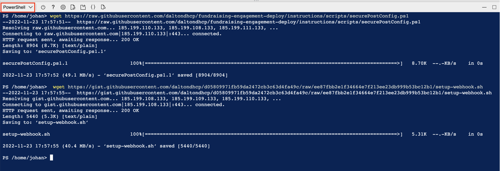
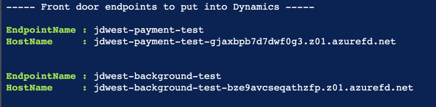

> > The sample script are not supported under any Microsoft standard support program or service. The sample codes are provided AS IS without warranty of any kind. Microsoft further disclaims all implied warranties including, without limitation, any implied warranties of merchantability or of fitness for a particular purpose. The entire risk arising out of the use or performance of the sample codes and documentation remains with you. In no event shall Microsoft, its authors, owners of this repository or anyone else involved in the creation, production, or delivery of the scripts be liable for any damages whatsoever (including, without limitation, damages for loss of business profits, business interruption, loss of business information, or other pecuniary loss) arising out of the use of or inability to use the sample scripts or documentation, even if Microsoft has been advised of the possibility of such damages

# Secure Fundraising and Engagement deployments

Fundraising and Engagement involves processing potentially sensitive data subject to standards such as [PCI DSS](https://learn.microsoft.com/en-us/azure/compliance/offerings/offering-pci-dss).
This means there are strict security requirements in areas like network flows that need to be considered when building the solution.

> **Note:** Microsoft doesn't provide guidance on compliance review of the solution nor the validation of solution for PCI DSS.

The purpose of this article is to describe the required network patterns as well as how to further enhance network security in Fundraising and Engagement deployments by enabling private connectivity. For
For general post-deployment considerations related to monitoring and data plane security, refer to [Fundraising and Engagement - Post-deployment considerations](https://learn.microsoft.com/en-us/dynamics365/industry/nonprofit/fundraising-engagement-deploy-overview#post-deployment-considerations) at Microsoft Learn.

## Solution overview – network flows

An overview of the individual Azure Components created for Fundraising and Engagement can be found [here](https://learn.microsoft.com/en-us/dynamics365/industry/nonprofit/fundraising-engagement-deploy-overview#overview-of-azure-components-used-by-fundraising--engagement).

In terms of inbound network flows, the Background Service/Payment Services function needs to be accessed directly from Dynamics 365/Power Platform. As it is currently not possible to connect from Power Platform to a private virtual network, the functions need to be exposed with public endpoints. The backend components (Key Vault, Storage, SQL database) only need to be accessed through the functions/Web Job and require no public endpoints.


## Post-deployment configuration

For a semi-automated deployment of the below architecture, follow the [Post-deployment configuration using PowerShell script](#post-deployment-azure-configuration-using-powershell-script) instructions.


After reconfiguring/securing the Azure resources, you need to reconfigure the Dynamics background service URI as well as the webhook for the payment service.

> **Note:** the following instructions assume that you have already deployed Fundraising and Engagement using the installer or manual instructions found at [Microsoft Learn](https://learn.microsoft.com/en-us/dynamics365/industry/nonprofit/fundraising-engagement-deploy-overview).

> If upgrading an existing installation, you may need to run/validate the post-deployment script/configuration again to ensure that everything is properly locked down.

### Prerequisites

Since all services will be attached to a virtual network, you need to create one virtual network (VNet) per environment tier (dev/test/prod) in the same region as the Azure components.

The Virtual Network size need to be at least /26 with the following subnets in place. Naming below is just an example. In case you intend to peer the network, ensure address space alignment.

|Subnet Name | Minimum Subnet Size | Purpose |
| --- | --- | --- |
| private-endpoints | /28 | Private endpoints will be attached to this subnet|
| app-services | /28 | [App services VNet integration](https://learn.microsoft.com/en-us/azure/app-service/overview-vnet-integration#subnet-requirements)|

> Note: If you configure [User Defined Routes](https://learn.microsoft.com/en-us/azure/virtual-network/virtual-networks-udr-overview#user-defined) and route traffic to a central firewall from the subnets, additional configuration may be required to make the solution work.


### Post-deployment Azure configuration using PowerShell script

The PowerShell script will configure/create the following components. Naming will be based on the prefix used when deploying the F&E solution.

* Validate Inputs
* Private DNS Zones for App Services/Functions, Key Vaults and SQL Server. The zones will be created in the solution resource group and linked to the VNet.
  * privatelink.database.windows.net
  * privatelink.vaultcore.azure.net
  * privatelink.azurewebsites.net
    > Note: *If you have centralized Private DNS in your Azure Environment, you may need to change/remove this part from the script.*

    <https://learn.microsoft.com/en-us/azure/dns/private-dns-getstarted-portal>
    <https://learn.microsoft.com/en-us/azure/private-link/private-endpoint-dns>
* Private Endpoints for Key Vaults, Functions and SQL Database
* Outbound VNet Integration of App Services/Functions
* Deployment of Azure Front Door
  * Create endpoint for Payment and Background service
  * Create origin for Payment and Background service
* Disable Azure Key Vault public access

---

#### Execute deployment

1. In Azure Cloud Shell, switch to PowerShell and run below command to download configuration scripts:

    ```bash
    wget https://raw.githubusercontent.com/daltondhcp/fundraising-engagement-deploy/main/scripts/securePostConfig.ps1
    ```

    
2. Execute the PowerShell configuration script as below. Ensure to change the parameters to reflect your resource group names, subscription id and subnet names from the virtual network.

   ```powershell
   ./securePostConfig.ps1 -SubscriptionId afffa704-8cbd-46f2-a146-b473f632ecb5 `
                          -ResourceGroupName fundraising-test `
                          -peSubnetName private-endpoints `
                          -appSubnetName app-services `
                          -Environment test
   ```

    

    The script takes around 10-15 minutes to execute.

    After successful execution, copy the Front Door endpoint URIs returned, they are needed in the subsequent steps.

    

3. Follow the instructions [here](https://learn.microsoft.com/en-us/dynamics365/industry/nonprofit/fundraising-engagement-deploy-manually#configuration-record-prerequisites) and update the Background services URI to the `*.z01.azurefd.net` endpoint from the previous step.

4. Follow the steps [here](https://learn.microsoft.com/en-us/dynamics365/industry/nonprofit/fundraising-engagement-deploy-manually#configure-payment-service-webhook-from-azure) to update the payment webhook URI to the `*.z01.azurefd.net` from step 2. Use the customized script/command line below instead of step 4 from Microsoft Learn.

    ```bash
    wget https://raw.githubusercontent.com/daltondhcp/fundraising-engagement-deploy/main/scripts/setup-webhook-afd.sh

    # Replace parameters to reflect values in the actual environment
    bash ./setup-webhook-afd.sh --group <RESOURCE_GROUP>  --url '<Dynamics_URL>' --afd-name *.z01.azurefd.net --function-name Payment-Service-test

    ```
